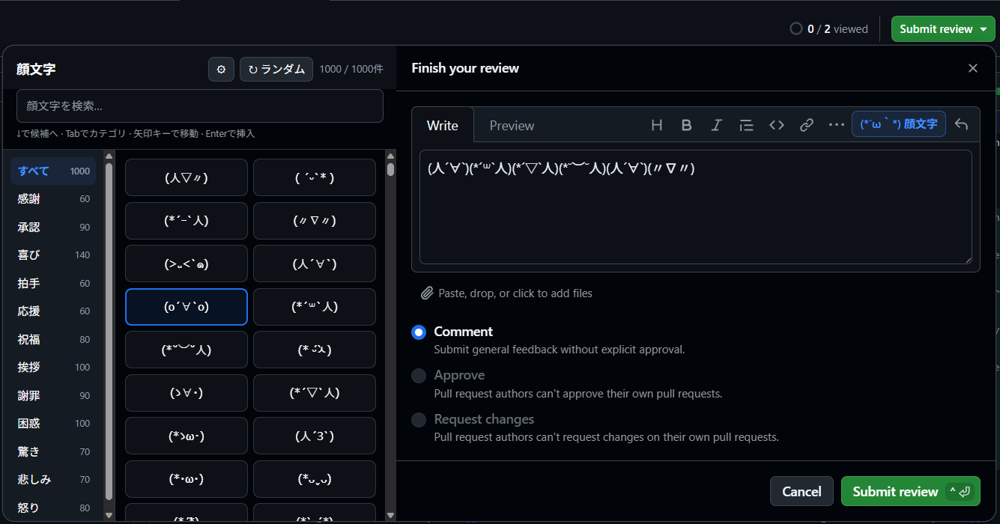

# GitHub Review Kaomoji

A Chrome Manifest V3 extension for inserting kaomoji into the final comment of
a GitHub pull request review.

This is an unofficial project and is not affiliated with or endorsed by
GitHub.



## Features

- 1,000 unique kaomoji in 12 Japanese categories
- Search by face, Japanese category, or Japanese and English keywords
- A category sidebar beside GitHub's **Finish your review** dialog
- Compact popover fallback when the viewport has no room for the sidebar
- Random candidate selection without accidental insertion
- Persistent auto-open and close-after-insert settings
- Cursor-aware insertion and selected-text replacement
- GitHub SPA and dynamically rendered review-dialog support
- Light and dark theme support through GitHub color variables

The extension only targets the final review textarea. It does not appear in
conversation comments or inline review comments.

## Keyboard controls

1. Open **Finish your review** and select **顔文字**.
2. Type in the focused search field, or press <kbd>↓</kbd> to enter results.
3. Use arrow keys to move through faces.
4. Press <kbd>Enter</kbd> to insert the focused face.
5. Press <kbd>Escape</kbd> to close the picker.

From the category sidebar, <kbd>↑</kbd>/<kbd>↓</kbd> changes category,
<kbd>→</kbd> enters results, and <kbd>←</kbd> returns to search.

## Picker settings

Use the **⚙** button in the picker header to change whether the picker opens
automatically and whether it closes after inserting a face. The defaults open
the picker automatically and keep it open after insertion.

## Privacy and permissions

The content script is available on `https://github.com/*` so it can follow
GitHub's same-document SPA navigation. It only observes and mounts UI on pull
request routes. The extension only requests the `storage` permission to save
the two picker settings locally. It performs no remote network requests and
stores no review text or browsing data.

## Development

```sh
mise install
pnpm install
pnpm dev
```

Build the production extension and load `.output/chrome-mv3` from
`chrome://extensions` using **Load unpacked**:

```sh
pnpm build
```

Run every required check:

```sh
pnpm check
```

Create a distribution ZIP:

```sh
pnpm zip
```

## Releases

Releases are prepared from Conventional Commit titles. Release Please keeps a
release pull request up to date and chooses the next version from merged
changes:

- `fix` creates a patch release
- `feat` creates a minor release
- `!` or `BREAKING CHANGE` creates a major release

Merging the release pull request runs all quality checks, packages the
extension, generates signed build provenance, and publishes the ZIP and its
SHA-256 checksum in an immutable GitHub Release. The first `v0.1.0` release is
started manually from the **Release** workflow; subsequent releases start
automatically when a Release Please pull request is merged.

Immutable Releases must remain enabled in the repository settings. Every
published release and its ZIP asset are verified by the workflow after
publication.

Download and verify a release with GitHub CLI:

```sh
gh release download v0.1.0
gh release verify v0.1.0
gh attestation verify github-review-kaomoji-0.1.0-chrome.zip \
  --repo tomatoaiu/github-review-kaomoji
```

To install a release without the Chrome Web Store, extract the downloaded ZIP
and select the extracted directory with **Load unpacked** at
`chrome://extensions`.

## Compatibility

The supported environment is the latest stable Chrome on `github.com`.
GitHub's CSS module class names are intentionally ignored; discovery uses the
review overlay's semantic attributes and the `markdown-toolbar[for]` link to
its textarea. If GitHub changes that structure, the picker fails closed and
leaves the native review form untouched.

## Kaomoji data

The bundled catalog is a curated and normalized subset of the MIT-licensed
[kaomoji-collection](https://github.com/kaomojiya-collection/kaomoji-collection).
See [THIRD_PARTY_NOTICES.txt](public/THIRD_PARTY_NOTICES.txt) for provenance
and license details.

## License

[MIT](LICENSE)
